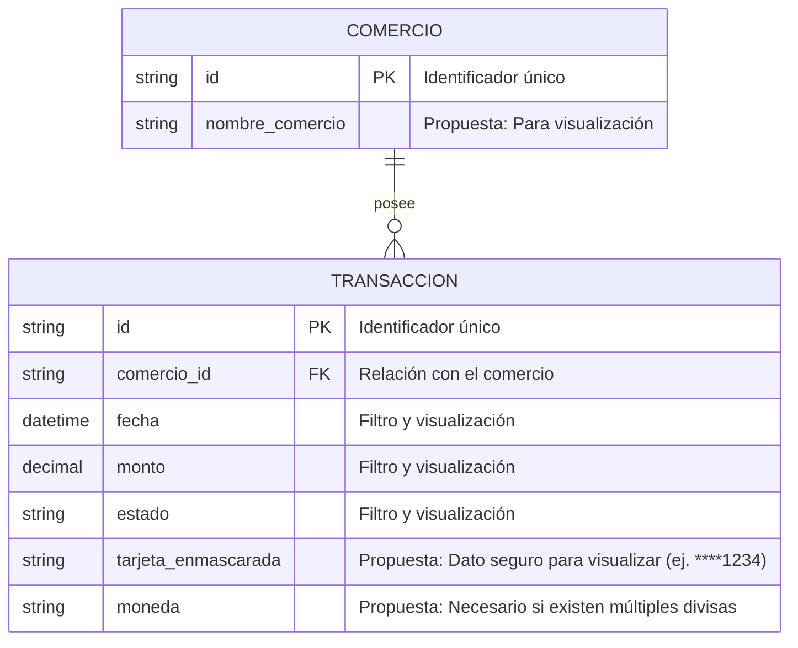

# Diagrama de Entidad-Relación: Historial de Transacciones

### Modelo ERD

### Supuestos

*   **Identificación del Comercio:** Existe una entidad lógica `COMERCIO` que agrupa las transacciones. Esto permite aplicar la regla de aislamiento de datos (cada comercio solo ve lo suyo) utilizando el `comercio_id` como clave foránea.
*   **Regla de los 90 días:** La restricción de no consultar datos con una antigüedad superior a 90 días se manejará mediante lógica de aplicación o consultas en base de datos (ej. cláusulas `WHERE`), por lo que no altera la estructura estática del modelo de datos.
*   **Ausencia de tablas auxiliares:** No se han modelado tablas paramétricas separadas para `estado` o `moneda` para mantener el diagrama en su forma más simple y estrictamente ligada a lo descrito en el PRD.

### Preguntas Abiertas

1.  **Moneda del monto:** ¿LegacyPay opera con una única moneda por defecto o es necesario confirmar la adición del campo propuesto `moneda` para evitar ambigüedades en el filtro de monto?
2.  **Trazabilidad:** ¿Se deben exponer campos adicionales de la pasarela que no sean confidenciales (ej. un `codigo_autorizacion` o `referencia_externa`) para facilitar la conciliación por parte del comercio?
3.  **Mutabilidad de la transacción:** ¿El `estado` de una transacción puede cambiar después de su creación inicial dentro del periodo de 90 días? De ser así, ¿se requiere proponer campos de auditoría como `fecha_actualizacion` para reflejar el momento del cambio?
