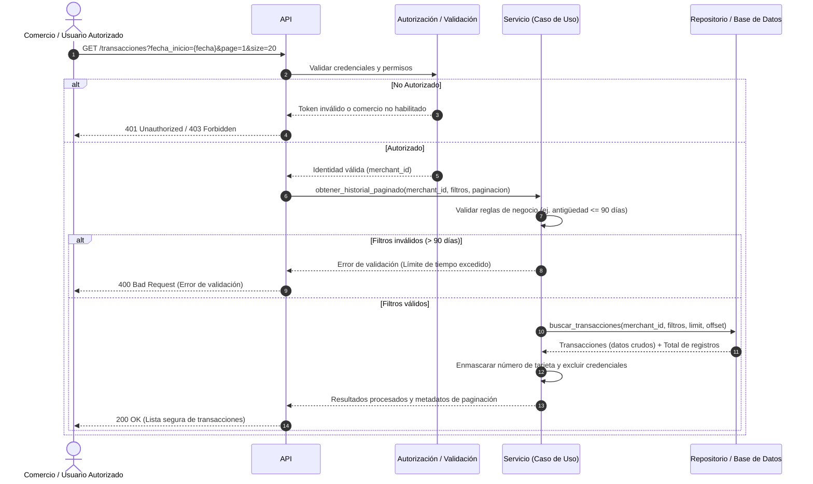

# Diagrama de Secuencia: Historial de Transacciones

Este diagrama representa el flujo de consulta del historial de transacciones basado en la **Historia de Usuario 1** del PRD: *Consulta paginada del historial de transacciones*. Cumple con las reglas de negocio de privacidad de datos, limitación de antigüedad y aislamiento por comercio.

